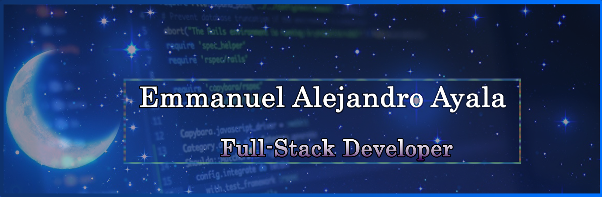
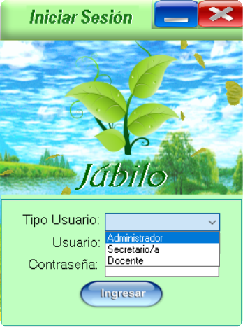
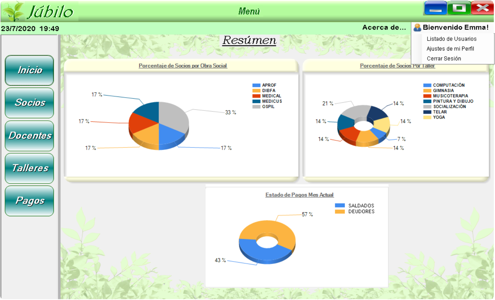
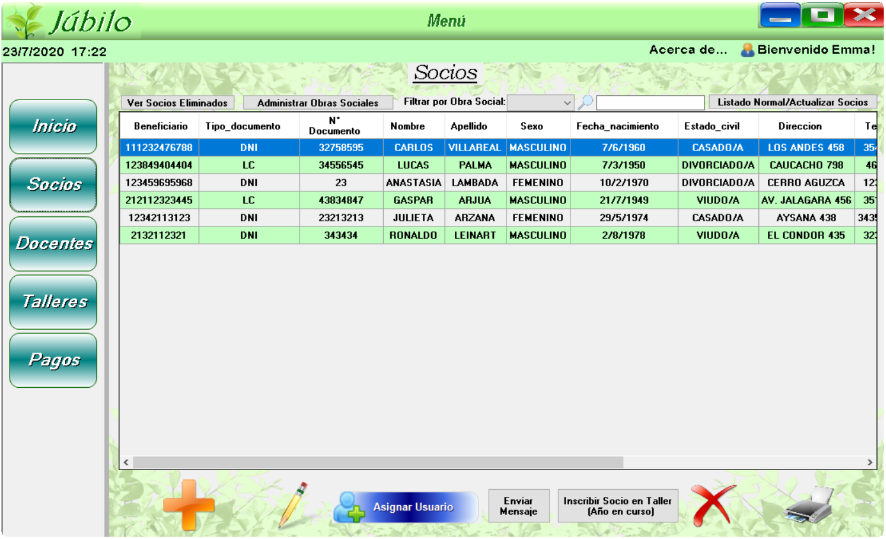
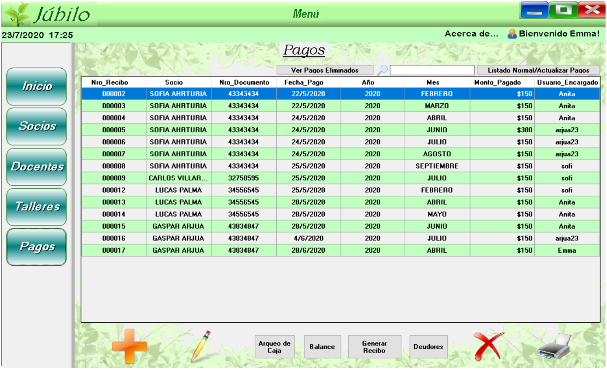

# **¡Hola!** :computer: :penguin:
Me llamo Emmanuel, recientemente Full-Stack Developer (en contínua formación) con un gusto intenso por diseñar GUIs hechas a medida y que representen el 100% de la calidad de un Software.

Tengo 21 años, acabo de graduarme y durante la pandemia pude mejorar mi formación en todas las distintas áreas de mi vida personal y profesional.

Amo la música, la ilustración, la producción de audio y las ediciones audiovisuales. Me gusta superarme a mí mismo siempre tratando de ser mi mejor versión, también me encanta el trabajo en equipo.

Me enamoré de la utilidad, el arte inimaginable y la magia que desprende la propia programación.

Si bien conozco el MVC (Model-View-Controller), aún sigo profundizando en el Back-End ya que todos los días en el trabajo aprendo cosas nuevas.

Mi enfoque son el cumplimiento de metas y objetivos, las buenas prácticas de programación y el código limpio.

---

Abajo presento uno de los proyectos en el cual estuve trabajando, también estoy desarrollando otros proyectos los cuales mostraré más adelante al terminarlos :point_down:

## **Main project** :rocket:

-Desarrollé una aplicación de escritorio para un centro de jubilados completo (solicitado por mis abuelos) durante 2 meses en solitario, la misma fué también mi tesis.

-[Link al Demo del Software - Youtube](https://youtu.be/uRA9luuZngg)

Gracias por su Visita.

---
<!--
## Mis competencias son :100: 

- **NombreTecnología:** Ejemplo.

**EmmaAyala/EmmaAyala** is a ✨ _special_ ✨ repository because its `README.md` (this file) appears on your GitHub profile.

Here are some ideas to get you started:

- 🔭 I’m currently working on ...
- 🌱 I’m currently learning ...
- 👯 I’m looking to collaborate on ...
- 🤔 I’m looking for help with ...
- 💬 Ask me about ...
- 📫 How to reach me: ...
- 😄 Pronouns: ...
- ⚡ Fun fact: ...
-->
