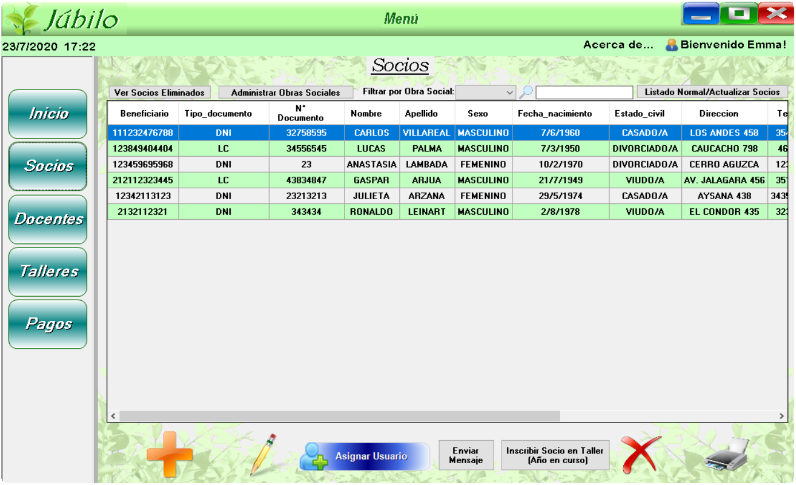

# **Fullstack Developer** :computer: :penguin:
¡Hola! Me llamo Emmanuel, soy Front-End Developer (próximamente Full Stack) con un gusto intenso por diseñar GUI hechas a medida, de forma apasionada y que representen el 100% de la calidad de un Software.

Tengo 21 años, acabo de graduarme y durante la pandemia pude mejorar mi formación en todas las distintas áreas de mi vida profesional además de la personal.

Amo la música, la ilustración, la producción de audio y las ediciones audiovisuales. Me gusta superarme a mí mismo siempre tratando de ser mi mejor versión, también me encanta el trabajo en equipo.

Me enamoré de la utilidad, el arte inimaginable y la magia que desprende la propia programación.

---

Abajo presento el último proyecto en el que estuve trabajando :point_down:

## **Principal project** :rocket:

-Desarrolle una aplicación de escritorio para un centro de jubilados completo (solicitado por mis abuelos) durante 2 meses en solitario.

-[Link al Demo del Proyecto - Youtube](https://youtu.be/uRA9luuZngg)

Gracias por su Visita.

---
<!--
## Mis competencias son :100: 

- **NombreTecnología:** Ejemplo.

**EmmaAyala/EmmaAyala** is a ✨ _special_ ✨ repository because its `README.md` (this file) appears on your GitHub profile.

Here are some ideas to get you started:

- 🔭 I’m currently working on ...
- 🌱 I’m currently learning ...
- 👯 I’m looking to collaborate on ...
- 🤔 I’m looking for help with ...
- 💬 Ask me about ...
- 📫 How to reach me: ...
- 😄 Pronouns: ...
- ⚡ Fun fact: ...
-->
